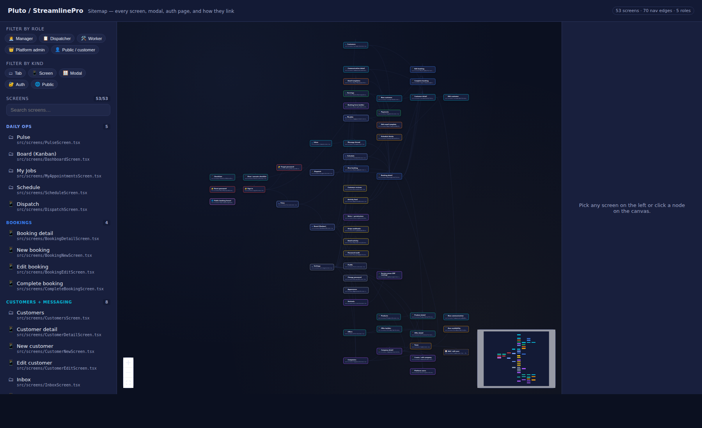

# flowdoc

> A **sitemap of your entire app** — every screen, modal, auth page, and the navigation between them — on a single zoomable canvas. Driven entirely by a JSON file. Works in any repo, optimized for React Native / Expo monorepos.

Open `flowdoc.html`: every screen of your app on one canvas. Click any node and the side panel shows its components, the path on disk, which roles can reach it, where you came from, and where you can go next. Filter by role or by kind (Tab / Screen / Modal / Auth / Public). Search by name, file, or component. The output is a single self-contained HTML file — no server, no CDN, drop it anywhere.



**Live demo:** https://serter2069.github.io/flowdoc/examples/pluto/flowdoc.html

## Why

"What's the whole shape of this app?" is the question that takes new contributors days to answer. They squint at the file tree, click around the running app, and slowly assemble a mental map. `flowdoc` flips it: see every screen at once, scoped to the role you care about, with the file path on each node so you can jump straight to the code.

## Install

```bash
npm install -g flowdoc
# or run on-demand:
npx flowdoc <command>
```

## Usage

```bash
# create a starter flows.json in the current directory
flowdoc init

# render flows.json → a single self-contained flowdoc.html
flowdoc build

# rebuild + browser refresh on every flows.json change
flowdoc serve
```

That's it. Open `flowdoc.html` in any browser — no server required.

## Example: Pluto

[`examples/pluto/flows.json`](examples/pluto/flows.json) is the full sitemap of a multi-tenant booking platform (Expo app + Laravel API): 52 screens, 99 nav edges, 5 roles, 12 groups (Daily ops, Bookings, Customers + messaging, Catalog + offers, Earnings + payments, Insights + audit, Email templates, Team, Platform admin, Account, Auth, Public web).

Filter the sidebar to "Worker" and you see just the Worker-facing surface (My Jobs, Booking detail, Complete booking, Earnings, etc.). Filter to "Modal" and you see only the inline forms. Click any screen — the right panel shows what's on it and which other screens it links to.

```bash
git clone https://github.com/serter2069/flowdoc.git
cd flowdoc && npm install && npm run build
node dist/cli.js build examples/pluto/flows.json -o pluto.html
open pluto.html
```

## The JSON

Three primary arrays: `roles`, `groups`, and `screens` (each screen carries its own `navTo` outgoing links — there's no separate edges array, though you can supply one if you want labeled edges).

```json
{
  "title": "My App",
  "subtitle": "Sitemap",
  "roles": [
    { "id": "admin", "name": "Admin", "icon": "👑", "color": "#7aa2ff" },
    { "id": "member", "name": "Member", "icon": "👤", "color": "#22c55e" }
  ],
  "groups": [
    { "id": "workspace", "name": "Workspace", "color": "#7aa2ff" },
    { "id": "auth", "name": "Auth", "color": "#ef4444" }
  ],
  "screens": [
    {
      "id": "home", "name": "Home", "kind": "tab", "group": "workspace",
      "path": "/(tabs)/home", "roles": ["admin", "member"],
      "components": ["Header", "FeedList", "FAB"],
      "navTo": ["item-detail", "item-new"]
    },
    {
      "id": "item-detail", "name": "Item detail", "kind": "screen",
      "group": "workspace", "path": "/items/:id",
      "roles": ["admin", "member"],
      "components": ["Header", "ItemFields", "ActionButtons"]
    },
    {
      "id": "item-new", "name": "New item", "kind": "modal",
      "group": "workspace", "components": ["Form", "SubmitButton"]
    },
    {
      "id": "login", "name": "Sign in", "kind": "auth", "group": "auth",
      "path": "/login", "navTo": ["home"]
    }
  ]
}
```

### Role fields
`id`, `name`, `icon?`, `color?`, `description?`.

### Group fields
`id`, `name`, `color?`, `description?`. Groups are how the sidebar organizes the screen list.

### Screen fields
- `id` — kebab-case
- `name` — what users see
- `kind` — one of `tab` · `drawer` · `screen` · `modal` · `auth` · `public` · `nested` · `external`
- `group?` — references `groups[].id`
- `path?` — file path or route (rendered under the node + in the detail panel)
- `description?`
- `roles?` — string[] of role ids who can reach this screen (drives the role filter)
- `components?` — string[] of key components on the screen
- `navTo?` — string[] of screen ids you can navigate to from here

### Optional `edges` array
If you want labeled edges (`"Tap +Add user"`) or edges of a particular `kind` (`modal` / `back` / `deeplink`), provide them explicitly:

```json
"edges": [
  { "from": "team", "to": "team-form", "kind": "modal", "label": "Tap +" }
]
```

## Output

`flowdoc build` writes a single HTML file:

- ~500 KB, self-contained (React + React Flow + your JSON inlined)
- No external requests at runtime
- Drop it into a static-site bucket, attach it to a release, or commit it next to your code
- Renders in any modern browser — no build step on the consumer's side

## Local development

```bash
git clone https://github.com/serter2069/flowdoc.git
cd flowdoc
npm install
npm run build              # produces dist/cli.js + dist/viewer/index.html
node dist/cli.js build examples/pluto/flows.json -o /tmp/pluto.html
npm run typecheck
```

## License

MIT
